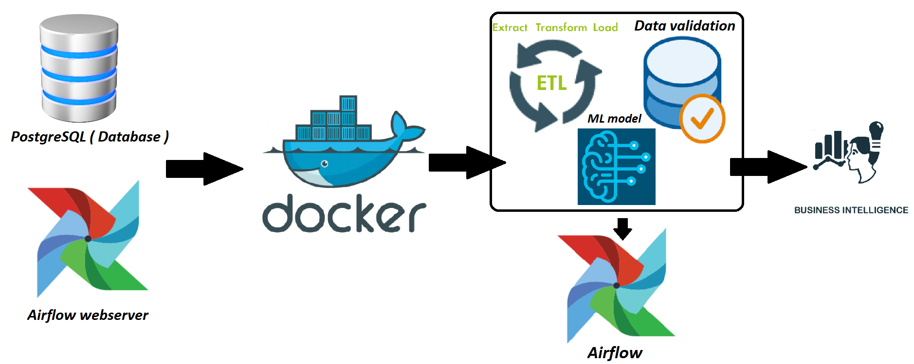

1. Contenerizing postgresql database and Airflow webserver using Docker
2. Loading data and creating function in database (with the help of dbeaver and VS code) - SQL
3. Creating dag in Airflow, tasks: validation, etl, ml_model - Dags
4. Analyzing data in Tableau or any BI tool

